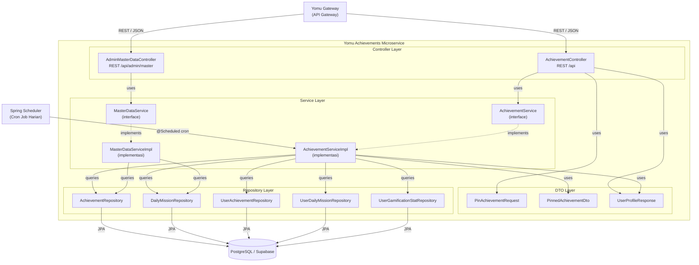
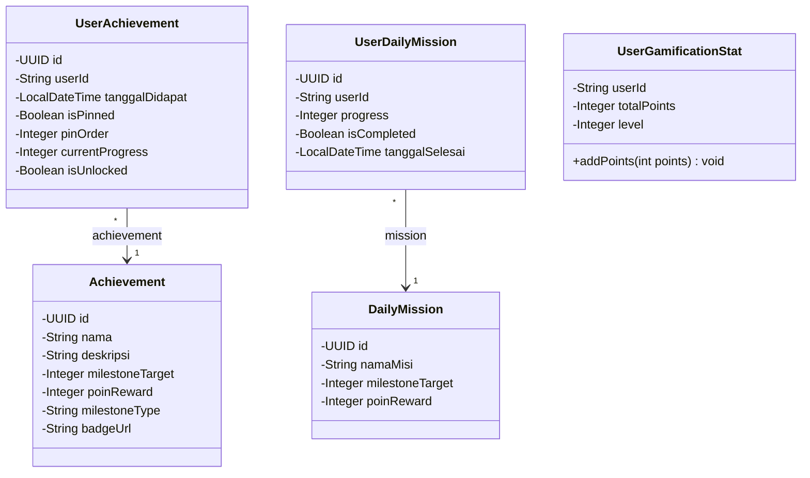
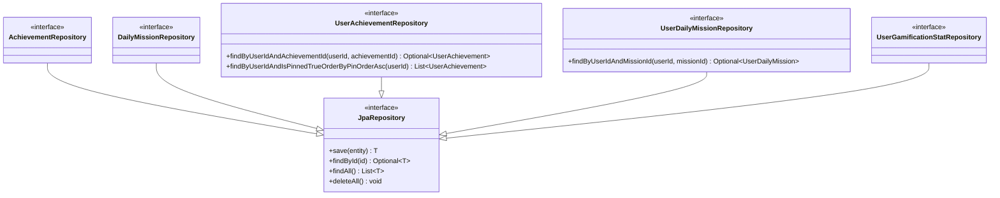
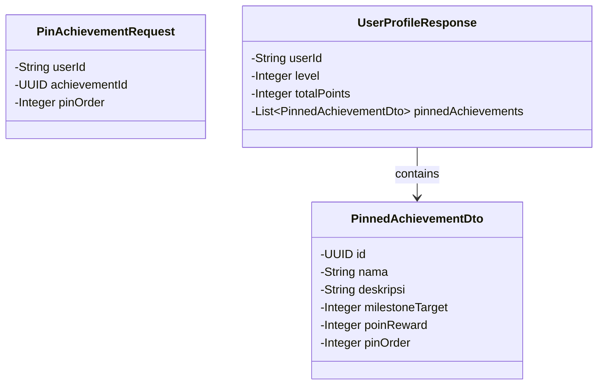

# yomu-achievements

## Component Diagram

Diagram berikut menunjukkan komponen-komponen internal dari microservice **Yomu Achievements** dan bagaimana mereka saling berinteraksi. Service ini bertanggung jawab atas fitur gamifikasi: Achievement, Daily Mission, Pinned Achievement, dan Leveling System.



### Penjelasan Komponen

| Komponen | Tanggung Jawab |
|---|---|
| **AchievementController** | Menerima request dari Gateway untuk update progres achievement/misi, pin achievement, dan mengambil profil gamifikasi user. |
| **AdminMasterDataController** | Menerima request dari admin untuk membuat data master (Achievement dan Daily Mission baru). |
| **AchievementServiceImpl** | Logika bisnis utama: tracking progres, distribusi poin, leveling, pin achievement, dan reset misi harian via cron job. |
| **MasterDataServiceImpl** | Logika bisnis sederhana untuk CRUD data master Achievement dan Daily Mission. |
| **Repository Layer** | 5 repository JPA yang masing-masing menangani persistence satu entity ke database PostgreSQL. |
| **DTO Layer** | Objek transfer data untuk request (`PinAchievementRequest`) dan response (`UserProfileResponse`, `PinnedAchievementDto`). |

---

## Code Diagram (Class Diagram)

### 1. Model / Entity Classes



### 2. Service & Controller Classes


### 3. Repository Interfaces



### 4. DTO Classes



---

## Performa & Kualitas Sistem

Bagian ini mendokumentasikan peningkatan performa yang terukur, hasil load testing, dan pengaturan observability yang diimplementasikan pada microservice ini.

---

### 1. Optimasi Performa: Menyelesaikan Masalah N+1 Query

**N+1 query problem** adalah anti-pattern umum pada JPA, di mana pengambilan daftar N record memicu N query database tambahan — satu per record. Masalah ini sengaja didemonstrasikan dan diselesaikan pada method `calculateTotalClanPoints`.

#### Penyebab Masalah
Implementasi naif (V1) mengiterasi daftar `userId` dan memanggil `repository.findById(userId)` di dalam loop. Untuk klan dengan 1.000 pengguna, ini menghasilkan **1.001 statement SELECT terpisah** ke database.

#### Solusi
Implementasi yang dioptimalkan (V2) mengganti seluruh loop dengan satu query agregat JPQL menggunakan `SUM(...) WHERE userId IN (...)`. Ini mengurangi **1.001 round-trip ke database menjadi hanya 1**, terlepas dari ukuran klan.

```java
// V2: Satu query agregat SQL — 1 pemanggilan DB untuk berapapun jumlah pengguna
@Query("SELECT COALESCE(SUM(s.totalPoints), 0) FROM UserGamificationStat s WHERE s.userId IN :userIds")
Integer sumTotalPointsByUserIds(@Param("userIds") List<String> userIds);
```

#### Hasil Benchmark

| Metrik | V1 (N+1 — Lambat) | V2 (Optimized) | Peningkatan |
|---|---|---|---|
| Waktu Eksekusi (1000 pengguna) | **172,7 detik** | **0,6 detik** | **~99% lebih cepat** |
| Round-trip ke DB | 1.001 | 1 | -99,9% |
| Skalabilitas | Linear (O(N)) | Konstan (O(1)) | ✅ |

**V1 — Bottleneck N+1 (Lambat):**


**V2 — Query Tunggal yang Dioptimalkan (Cepat):**


---

### 2. Load Testing (k6)

Load test dilakukan menggunakan [k6](https://k6.io/) untuk memverifikasi bahwa endpoint yang telah dioptimalkan dapat menangani traffic tinggi secara bersamaan tanpa mengalami degradasi performa.

#### Konfigurasi Pengujian

| Parameter | Nilai |
|---|---|
| Tool | k6 |
| Target Endpoint | `GET /api/benchmark/clan-points/optimized` |
| Virtual Users (VUs) | **100 VU secara bersamaan** |
| Durasi | **30 detik** (steady-state) |
| Threshold: Latensi P95 | Harus **< 200ms** |
| Threshold: Error Rate | Harus **< 1%** |

#### Hasil Pengujian

| Metrik | Hasil | Threshold | Status |
|---|---|---|---|
| Total Request | **3.325** | — | ✅ |
| Request/detik | ~110 req/s | — | ✅ |
| Latensi P95 | < 200ms | < 200ms | ✅ LULUS |
| Error Rate | **0,00%** | < 1% | ✅ LULUS |

Semua threshold yang dikonfigurasi **terpenuhi** — endpoint yang dioptimalkan menangani 100 pengguna bersamaan dengan nol error dan latensi P95 di bawah 200ms.

**Ringkasan Load Test k6:**


---

### 3. Observability — Sentry APM

[Sentry](https://sentry.io/) diintegrasikan ke dalam microservice ini untuk **Application Performance Monitoring (APM)** secara real-time, yang menyediakan:

- **Transaction Tracing:** Setiap HTTP request yang masuk ditangkap sebagai transaksi Sentry, menampilkan flame graph lengkap dari waktu yang dihabiskan di setiap lapisan (controller → service → repository → DB).
- **APDEX Score:** Dihitung secara otomatis berdasarkan threshold kepuasan yang dikonfigurasi (T = 500ms). Request yang lebih cepat dari T adalah *Satisfied*; antara T dan 4T adalah *Tolerating*; di atas 4T adalah *Frustrated*.
- **Deteksi Query Lambat:** Query database yang melebihi `slow-request-threshold` (500ms) secara otomatis ditandai dan dilampirkan ke transaksi induknya di dashboard Sentry.
- **100% Sampling:** Selama pengembangan, `traces-sample-rate=1.0` menangkap setiap transaksi. Nilai ini dapat diturunkan menjadi `0.2` di lingkungan produksi untuk mengurangi volume data.

**Dashboard Sentry APM:**


#### Konfigurasi

Sentry diaktifkan dengan mengatur `SENTRY_DSN` di file `.env` Anda:

```properties
# application.properties
sentry.dsn=${SENTRY_DSN}
sentry.traces-sample-rate=1.0
sentry.enable-db-query-tracing=true
sentry.slow-request-threshold=500
```

```env
# .env
SENTRY_DSN=https://<your-key>@o<org-id>.ingest.sentry.io/<project-id>
```


---

### 1. Performance Optimization: Solving the N+1 Query Problem

A common JPA anti-pattern is the **N+1 query problem**, where fetching a list of N records triggers N additional database queries — one per record. This was intentionally demonstrated and resolved in the `calculateTotalClanPoints` methods.

#### Root Cause
The naive implementation (V1) iterates over a list of `userId`s and calls `repository.findById(userId)` inside a loop. For a clan of 1,000 users, this produces **1,001 separate SELECT statements** to the database.

#### Solution
The optimized implementation (V2) replaces the loop entirely with a single JPQL aggregate query using `SUM(...) WHERE userId IN (...)`. This reduces **1,001 DB round-trips to exactly 1**, regardless of clan size.

```java
// V2: Single SQL aggregate — 1 DB call for any number of users
@Query("SELECT COALESCE(SUM(s.totalPoints), 0) FROM UserGamificationStat s WHERE s.userId IN :userIds")
Integer sumTotalPointsByUserIds(@Param("userIds") List<String> userIds);
```

#### Benchmark Results

| Metric | V1 (N+1 — Slow) | V2 (Optimized) | Improvement |
|---|---|---|---|
| Execution Time (1000 users) | **172.7 seconds** | **0.6 seconds** | **~99% faster** |
| DB Round-trips | 1,001 | 1 | -99.9% |
| Scalability | Linear (O(N)) | Constant (O(1)) | ✅ |

**V1 — N+1 Bottleneck (Slow):**


**V2 — Optimized Single Query (Fast):**


---

### 2. Load Testing (k6)

A load test was conducted using [k6](https://k6.io/) to verify that the optimized endpoint can sustain high concurrent traffic without degrading.

#### Test Configuration

| Parameter | Value |
|---|---|
| Tool | k6 |
| Target Endpoint | `GET /api/benchmark/clan-points/optimized` |
| Virtual Users (VUs) | **100 concurrent VUs** |
| Duration | **30 seconds** (steady-state) |
| Threshold: P95 Latency | Must be **< 200ms** |
| Threshold: Error Rate | Must be **< 1%** |

#### Results

| Metric | Result | Threshold | Status |
|---|---|---|---|
| Total Requests | **3,325** | — | ✅ |
| Requests/sec | ~110 req/s | — | ✅ |
| P95 Response Time | < 200ms | < 200ms | ✅ PASSED |
| Error Rate | **0.00%** | < 1% | ✅ PASSED |

All configured thresholds were **met** — the optimized endpoint handles 100 concurrent users with zero errors and sub-200ms P95 latency.

**k6 Load Test Summary:**


---

### 3. Observability — Sentry APM

[Sentry](https://sentry.io/) is integrated into this microservice for real-time **Application Performance Monitoring (APM)**, providing:

- **Transaction Tracing:** Every incoming HTTP request is captured as a Sentry performance transaction, showing a full flame graph of time spent in each layer (controller → service → repository → DB).
- **APDEX Score:** Automatically computed based on a configured satisfaction threshold (T = 500ms). Requests faster than T are *Satisfied*; between T and 4T are *Tolerating*; above 4T are *Frustrated*.
- **Slow Query Detection:** Any database query exceeding the `slow-request-threshold` (500ms) is automatically flagged and attached to its parent transaction in the Sentry dashboard.
- **100% Sampling:** During development, `traces-sample-rate=1.0` captures every transaction. This can be lowered to `0.2` in production to reduce data volume.

**Sentry APM Dashboard:**


#### Configuration

Sentry is activated by setting `SENTRY_DSN` in your `.env` file:

```properties
# application.properties
sentry.dsn=${SENTRY_DSN}
sentry.traces-sample-rate=1.0
sentry.enable-db-query-tracing=true
sentry.slow-request-threshold=500
```

```env
# .env
SENTRY_DSN=https://<your-key>@o<org-id>.ingest.sentry.io/<project-id>
```
